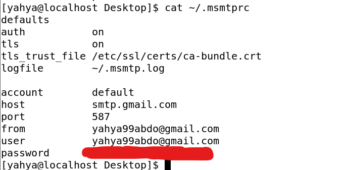

# Daily Processes Report Script  

This Bash script automates the generation of daily reports on running processes, highlights stopped or problematic processes, and sends the report to a specified email.  
![Daily Processes Report][4.png]
---

## Features  
1. **Generate Process Reports**: Captures details of all active processes and saves them to a file.  
2. **Detect Problematic Processes**: Identifies stopped, zombie, or high CPU usage processes.  
3. **Email Notifications**: Sends daily reports with highlighted issues to the specified email address.  
4. **Temporary File Cleanup**: Removes generated files after processing.  

---

## Prerequisites  
The script is designed for CentOS systems and requires the following:  
1. **Mail Sending Tool**: `msmtp` for email notifications.  
2. **Bash Shell**: Script is compatible with Bash.  
3. **Root Privileges**: For process monitoring and email configuration.  

---

## Installation  

Follow these steps to install and use the script on CentOS:  

### Step 1: Install Required Packages  
Run the following commands to install the dependencies:  
```bash  
sudo yum install msmtp -y  # Mail sending utility
```  

### Step 2: Configure `msmtp`  
Set up `msmtp` for sending emails:  
1. **Create or Edit Configuration File**:  
   - Global configuration: `/etc/msmtprc`  
   - User-specific configuration: `~/.msmtprc`  

   Example configuration (`~/.msmtprc`):  
   ```bash  
   account default  
   host smtp.gmail.com  
   port 587  
   auth on  
   user your-email@gmail.com  
   password your-email-password  
   tls on  
   logfile /tmp/msmtp.log  
   ```  
   Replace `your-email@gmail.com` and `your-email-password` with your Gmail credentials.  
    

2. **Set File Permissions**:  
   ```bash  
   chmod 600 ~/.msmtprc  
   ```  

### Step 3: Copy the Script  
1. Save the script as `daily_process_report.sh`.  
2. Move the script to `/usr/local/bin` for system-wide access:  
   ```bash  
   sudo mv daily_process_report.sh /usr/local/bin/daily_process_report.sh  
   ```  

### Step 4: Make the Script Executable  
```bash  
sudo chmod +x /usr/local/bin/daily_process_report.sh  
```  

### Step 5: Verify Email Functionality  
Test email sending with `msmtp`:  
```bash  
echo "Test email from msmtp" | msmtp --debug --logfile=/tmp/msmtp.log your-email@gmail.com  
```  
Check `/tmp/msmtp.log` for any errors.
  
### Step 6: Test the Script  
Run the script manually to confirm it's working:  
```bash  
/usr/local/bin/daily_process_report.sh  
```  

---

## Automating the Script (Optional)  
To run the script daily, schedule it using cron:  
```bash  
crontab -e  
```  
Add the following line to execute the script at 7 AM daily:  
```bash  
0 7 * * * /usr/local/bin/daily_process_report.sh  
```  
  
